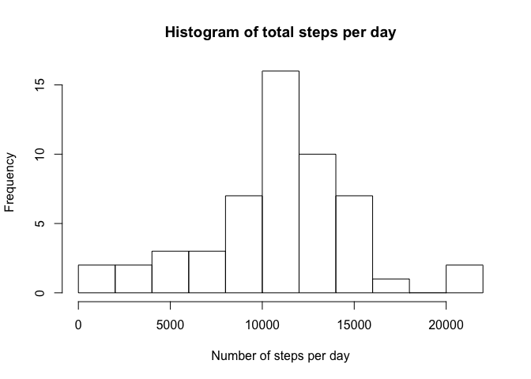
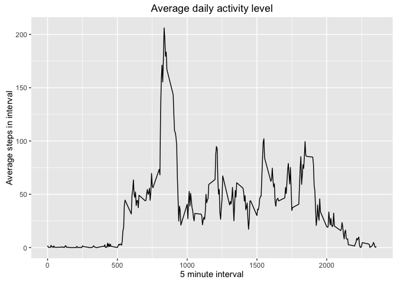

# Reproducible Research: Peer Assessment 1


## Loading and preprocessing the data

Data is unzipped and the .csv file contained in the zip file is read into memory.


```r
unzip("activity.zip")
activity <- read.csv("activity.csv")
activity$date <- as.Date(activity$date)
# activity$time <- 
```

## What is mean total number of steps taken per day?

Use aggregate to get total number of steps per day and create historam and table output.


```r
activityDay <- aggregate(data=activity[,1:2], .~date, sum)
names(activityDay) <- c("Date", "TotalSteps")
hist(activityDay$TotalSteps, breaks=10, main="Histogram of total steps per day", xlab="Number of steps per day")
```

<!-- -->

```r
meanSteps <- mean(activityDay$TotalSteps)
medianSteps <- median(activityDay$TotalSteps)

summarySteps <- data.frame(Mean = mean(activityDay$TotalSteps), Median = median(activityDay$TotalSteps))
names(summarySteps) <- c("Mean Steps","Median Steps")
kable(summarySteps, align = "c", format = "html", table.attr = "style='width:40%;'",
      caption = "Daily steps summary")
```

<table style='width:40%;'>
<caption>Daily steps summary</caption>
 <thead>
  <tr>
   <th style="text-align:center;"> Mean Steps </th>
   <th style="text-align:center;"> Median Steps </th>
  </tr>
 </thead>
<tbody>
  <tr>
   <td style="text-align:center;"> 10766.19 </td>
   <td style="text-align:center;"> 10765 </td>
  </tr>
</tbody>
</table>

## What is the average daily activity pattern?


```r
# activity<-merge(activity,activityDay,by.x="date", by.y="Date")

activityInterval <- aggregate(data=activity[,c(1,3)], .~interval, mean)

#plot(activity$interval,activity$steps, type='l')
ggplot(activityInterval) + geom_line(aes(interval,steps)) + 
    labs(title="Average daily activity level", x="5 minute interval", y="Average steps in interval")
```

<!-- -->

```r
maxInd <- which.max(activityInterval$steps)
maxInt <- activityInterval$interval[maxInd]
maxTime <- paste(substr(maxInt,1,nchar(maxInt)-2),substr(maxInt,nchar(maxInt)-1,nchar(maxInt)), sep=":")
```

On average the maximum number of steps in a day occurs in the 104^th^ 5 minute interval which is labelled as 835 or 8:35.

## Imputing missing values


## Are there differences in activity patterns between weekdays and weekends?
