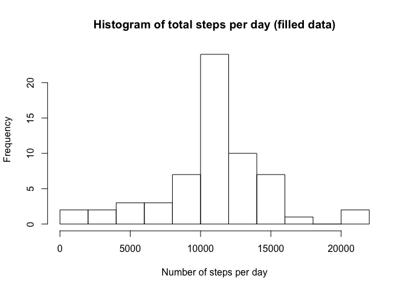
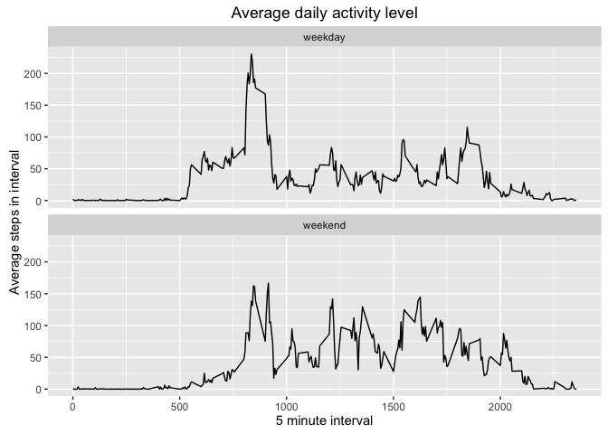

# Reproducible Research: Peer Assessment 1
Will Hore-Lacy  


```r
# echo = TRUE to show all code chunks
knitr::opts_chunk$set(echo = TRUE)
library(knitr)
library(ggplot2)
```

```
## Warning: package 'ggplot2' was built under R version 3.2.4
```

## Loading and preprocessing the data

Data is unzipped and the .csv file contained in the zip file is read into memory.


```r
unzip("activity.zip")
activity <- read.csv("activity.csv")
activity$date <- as.Date(activity$date)
```

## What is mean total number of steps taken per day?

Use aggregate to get total number of steps per day and create historam and table output.


```r
activityDay <- aggregate(data=activity[,1:2], .~date, sum)
names(activityDay) <- c("Date", "TotalSteps")
hist(activityDay$TotalSteps, breaks=10, main="Histogram of total steps per day", xlab="Number of steps per day")
```

<!-- -->

```r
meanSteps <- mean(activityDay$TotalSteps)
medianSteps <- median(activityDay$TotalSteps)

summarySteps <- data.frame(Mean = mean(activityDay$TotalSteps), Median = median(activityDay$TotalSteps))
names(summarySteps) <- c("Mean Steps","Median Steps")
kable(summarySteps, align = "c", format = "html", table.attr = "style='width:40%;'",
      caption = "Daily steps summary")
```

<table style='width:40%;'>
<caption>Daily steps summary</caption>
 <thead>
  <tr>
   <th style="text-align:center;"> Mean Steps </th>
   <th style="text-align:center;"> Median Steps </th>
  </tr>
 </thead>
<tbody>
  <tr>
   <td style="text-align:center;"> 10766.19 </td>
   <td style="text-align:center;"> 10765 </td>
  </tr>
</tbody>
</table>

## What is the average daily activity pattern?

Aggregated based on the interval to get the average for each intervale across all the days.  Plot data to show the most active times of days.


```r
activityInterval <- aggregate(data=activity[,c(1,3)], .~interval, mean)

ggplot(activityInterval) + geom_line(aes(interval,steps)) + 
    labs(title="Average daily activity level", x="5 minute interval", y="Average steps in interval")
```

<!-- -->

```r
# Convert items into variabls to display in line with the text below.
maxInd <- which.max(activityInterval$steps)
maxInt <- activityInterval$interval[maxInd]
maxTime <- paste(substr(maxInt,1,nchar(maxInt)-2),substr(maxInt,nchar(maxInt)-1,nchar(maxInt)), sep=":")
```

On average the maximum number of steps in a day occurs in the 104^th^ 5 minute interval which is labelled as 835 or 8:35.

## Imputing missing values

Number of missing values in the steps variable: 2304


```r
# number above is produced using inline r code: sum(is.na(activity$steps))

# Fucntion to fill in NA gaps with data from the interval averages.
fillGap <- function(x) {
    if(is.na(x["steps"])) {
        as.integer(activityInterval$steps[activityInterval$interval==as.integer(x["interval"])])
    } else {
        as.integer(x["steps"])
    }
}

# Duplicate the activity data frame and overwrite steps with filled data
activity2<-activity
activity2$steps<-apply(activity,1,fillGap)

# Aggreate on data for histogram
activityDay2 <- aggregate(data=activity2[,1:2], .~date, sum)
names(activityDay2) <- c("Date", "TotalSteps")
hist(activityDay2$TotalSteps, breaks=10, main="Histogram of total steps per day (filled data)", xlab="Number of steps per day")
```

<!-- -->

```r
# Produce summary table
meanSteps <- mean(activityDay2$TotalSteps)
medianSteps <- median(activityDay2$TotalSteps)

summarySteps2 <- data.frame(Mean = mean(activityDay$TotalSteps), Median = median(activityDay$TotalSteps))
names(summarySteps2) <- c("Mean Steps","Median Steps")
kable(summarySteps2, align = "c", format = "html", table.attr = "style='width:40%;'",
      caption = "Daily steps summary")  
```

<table style='width:40%;'>
<caption>Daily steps summary</caption>
 <thead>
  <tr>
   <th style="text-align:center;"> Mean Steps </th>
   <th style="text-align:center;"> Median Steps </th>
  </tr>
 </thead>
<tbody>
  <tr>
   <td style="text-align:center;"> 10766.19 </td>
   <td style="text-align:center;"> 10765 </td>
  </tr>
</tbody>
</table>
  <br>
Histogram shows a higher count with a similar profile.  The mean and median remained the same which makes sense if the missing data occured in full day blocks.

## Are there differences in activity patterns between weekdays and weekends?


```r
# Function to split data into weekends and weekdays
wdays <- function(y) {
    ydate <- as.Date(y["date"])
    if (weekdays(ydate)=="Saturday" | weekdays(ydate)=="Sunday") {
        2
    } else {
        1
    }
}

activity2$wday <- factor(apply(activity2,1,wdays), labels = c("weekday", "weekend"))

# Aggreagate on interval and weekday
activityIntervalWday <- aggregate(data=activity2[,c(1,3,4)], .~interval+wday, mean)

# Line plot with facet on weekday
ggplot(activityIntervalWday) + geom_line(aes(interval,steps)) + facet_wrap("wday", ncol=1) +
    labs(title="Average daily activity level", x="5 minute interval", y="Average steps in interval")
```

<!-- -->

Weekday the activity starts earlier and peaks higher in the morning.  Weekends show more activity through the middle of the day and after 8pm (2000).

